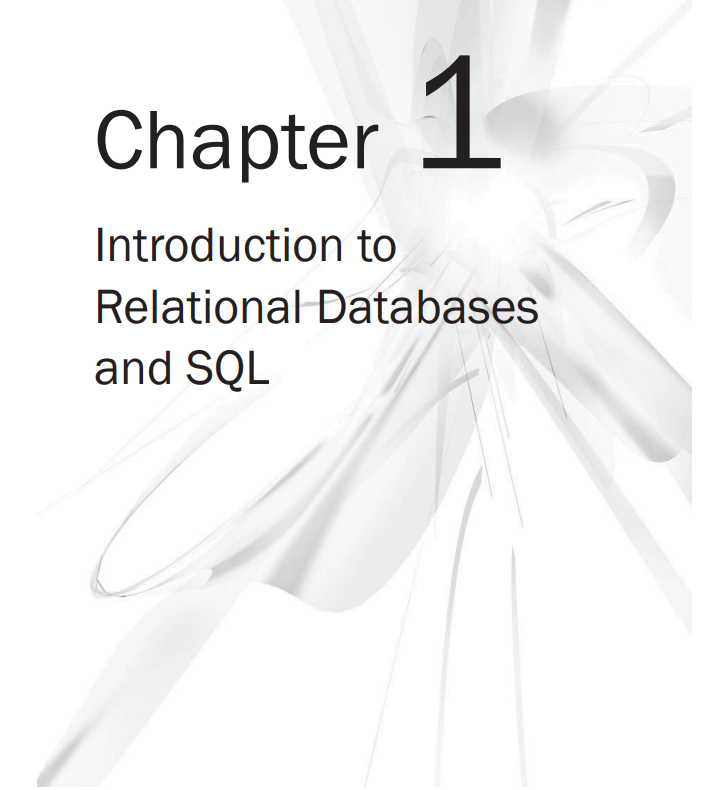

## Understand Relational Databases

Structured Query Language (SQL) supports creating and maintaining the relational database and managing data within that
database.

Mean by the term database, at the very least, is a collection of data organized in a structured format defined by
metadata describing that structure. There are several database models for storing and managing data. Some of the most
common models include the following:

* **Hierarchical** This model has a parent–child structure similar to an inverted tree, which forms the hierarchy. Data
  is organized in _nodes_, the logical equivalent of tables in a relational database. A parent node can have many child
  nodes, but a child node can have only one parent node. Although the model has been highly implemented, it is often
  considered unsuitable for many applications because of its inflexible structure and lack of support for complex
  relationships.
* **Network** This model addresses some of the limitations of the hierarchical model. Data is organized in _record
  types_, the logical equivalent of tables in a relational database. Like the hierarchical model, the network model uses
  an inverted tree structure, but record types are organized into a set structure that relates pairs of record types
  into owners and members. The anyone record type can participate in any set with other record types in the database,
  which supports more complex queries and relationships than are possible in the hierarchical model. Still, the network
  model has its limitations, the most serious of which is complexity. In accessing the database, users must be very
  familiar with the structure and keep careful track of where they are and how they got there. It’s also difficult to
  change the structure without affecting applications that interact with the database.
* **Relational** This model addresses many of the limitations of both the hierarchical and network models. In a
  hierarchical or network database, the application relies on a defined implementation of that database, which is then
  hard-coded into the application. If you add a new attribute (data item) to the database, you must modify the
  application, even if it doesn’t use the attribute. However, a relational database is independent of the application;
  you can make non-destructive modifications to the structure without impacting the application. In addition, the
  structure of the relational database is based on the relation, or table, along with the ability to define complex
  relationships between these relations. Each relation can be accessed directly, without the cumbersome limitations of a
  hierarchical or owner/member model that requires the navigation of a complex data structure. In the following section,
  “The Relational Model,” I’ll discuss the model in more detail.

The relational model is the most extensively implemented model in modern business systems, and it is the relational
model that provides the foundation for SQL. The relational model, which is rooted primarily in the mathematical
principles of set theory and predicate logic, supports easy data retrieval, enforces data integrity (data accuracy and
consistency), and provides a database structure independent of the applications accessing the stored data. At the core
of the relational model is the relation.

A relation is a set of columns and rows collected in a table-like structure that represents a single entity made up of
related data.


Two very important considerations in the design and implementation of any relational database are the normalization of
data and the associations of relations among the various types of data.

**Normalizing Data**

Central to the principles of the relational model is the concept of normalization, a technique for producing a set of
relations that possess a certain set of properties that minimizes redundant data and preserves the integrity of the
stored data as data is maintained (added, updated, and deleted). Normalization defines sets of rules, referred to as
normal forms, which provide specific guidelines on how data should be organized in order to avoid anomalies that
lead to inconsistencies in and loss of data as the data stored in the database is maintained.

Tree normal forms of normalization

**Choosing a Unique Identifier**

A unique identifier is an attribute or set of attributes that uniquely identifies each row of data in a relation. The
unique identifier will eventually become the primary key of the table created in the physical database from the
normalized relation, but many use the terms unique identifier and primary key interchangeably. Each potential unique
identifier is called a candidate key, and when there are multiple candidates, the designer will choose the best one,
which is the one least likely to change values or the one that is the simplest and/or shortest. In many cases, a single
attribute can be found that uniquely identifies the data in each tuple of the relation. However, when no single
attribute can be found that is unique, the designer looks for several attributes that can be concatenated (put together)
in order to form the unique identifier. In the few cases where no reasonable candidate keys can be found, the designer
must invent a unique identifier called a surrogate key, often with values assigned sequentially or randomly as tuples
are added to the relation. While not absolutely required until second normal form, it is customary to select a unique
identifier as the first step in normalization. It’s just easier that way.

**First Normal Form**

First normal form, which provides the foundation for second and third normal forms, includes the following guidelines:

* Each attribute of a tuple must contain only one value.
* Each tuple in a relation must contain the same number of attributes.
* Each tuple must be different, meaning that the combination of all attribute values for a given tuple cannot be the
  same as any other tuple in the same relation.

**Second Normal Form**

To understand second normal form, you must first understand the concept of _functional dependence_. Attribute B is
_functionally dependent_ (_dependent_ for short) on attribute A if at any moment in time there is no more than one value
of attribute B associated with a given value of attribute A. Lest you wonder what planet I lived on before this one,
let’s try to make the definition more understandable. If we say that attribute B is functionally dependent on attribute
A, we are also saying that attribute A _determines_ attribute B, or that A is a _determinant_ (unique identifier) of
attribute B.

**Third Normal Form**

Third normal form, like second normal form, is dependent on the relation’s unique identifier. To adhere to the
guidelines of third normal form, a relation must be in second normal form and nonkey attributes (attributes that are not
part of any candidate key) must be independent of each other and dependent on the unique identifier.

**_NOTE_**

```text
In the theoretical world of relational design, the goal is to store data according to the rules of normalization. 
However, in the real world of database implementation, we must occasionally denormalize data, which means to
deliberately violate the rules of normalization, particularly the second and third normal forms. Denormalization
is used primarily to improve performance or reduce complexity in cases where an overnormalized structure complicates 
implementation. Still, the goal of normalization is to ensure data integrity, so denormalization should be performed
with great care and as a last resort.
```

**Relationships**
Important component of any relational database is how those relations are associated with each other. These
associations, or relationships, link relations together in meaningful ways, which helps to ensure the integrity of the
data so that an action taken in one relation does not negatively impact data in another relation.
There are three primary types of relationships:

* **One-to-one** A relationship between two relations in which a tuple in the first relation
  is related to at most one tuple in the second relation, and a tuple in the second relation is
  related to at most one tuple in the first relation.
* **One-to-many** A relationship between two relations in which a tuple in the first relation is
  related to zero, one, or more tuples in the second relation, but a tuple in the second relation
  is related to at most one tuple in the first relation.
* **Many-to-many** A relationship between two relations in which a tuple in the first relation
  is related to zero, one, or more tuples in the second relation, and a tuple in the second
  relation is related to zero, one, or more tuples in the first relation.

The best way to illustrate these relationships is to look at a data model of several relations. The relations are named
to make referencing them easier. As you can see, all three types of relationships are represented:


**Object Relational Model**

The SQL language is based on the relational model, and up through SQL-92, so was the SQL standard. However, beginning
with SQL:1999, the SQL standard extended beyond the pure relational model to include object-oriented constructs into the
language. These constructs are based on the concepts inherent in object-oriented programming, a programming methodology
that defines self-contained collections of data structures and routines (called objects). In object-oriented languages
such as Java and C++, the objects interact with one another in ways that allow the language to address complex problems
that were not easily resolved in traditional languages.

With the advent of object-oriented programming—along with advances in hardware and software technologies and the growing
complexities of applications—it became increasingly apparent that a purely relational language was inadequate to meet
the demands of the real world. Of specific concern was the fact that SQL could not support complex and user-defined data
types or the extensibility required for more complicated applications. Fueled by the competitive nature of the industry,
RDBMS vendors took it upon themselves to augment their products and incorporate object-oriented functionality into their
systems. The SQL:2006 standard follows suit and extends the relational model with object-oriented capabilities, such as
methods, encapsulation, and complex user-defined data types, making SQL an object-relational database language. As shown
in Table 1-1, Part 14 (SQL/XML) was significantly expanded and republished with SQL:2006, and all the other parts are
carried over from SQL:2003.

**Types of SQL Statements**

Although SQL is considered a sublanguage because of its nonprocedural nature, it is nonetheless a complete language in
that it allows you to create and maintain database objects, secure those objects, and manipulate the data within the
objects. One common method used to categorize SQL statements is to divide them according to the functions they perform.
Based on this method, SQL can be separated into three types of statements:

* **Data Definition Language (DDL)** DDL statements are used to create, modify, or delete database objects such as tables,
  views, schemas, domains, triggers, and stored procedures. The SQL keywords most often associated with DDL statements
  are CREATE, ALTER, and DROP. For example, you would use the CREATE TABLE statement to create a table, the ALTER TABLE
  statement to modify the table’s properties, and the DROP TABLE statement to delete the table definition from the
  database.
* **Data Control Language (DCL)** DCL statements allow you to control who or what (a database user can be a person or an
  application program) has access to specific objects in your database. With DCL, you can grant or restrict access by
  using the GRANT or REVOKE statements, the two primary DCL commands. The DCL statements also allow you to control the
  type of access each user has to database objects. For example, you can determine which users can view a specific set
  of data and which users can manipulate that data.
* **Data Manipulation Language (DML)** DML statements are used to retrieve, add, modify, or delete data stored in your
  database objects. The primary keywords associated with DML statements are SELECT, INSERT, UPDATE, and DELETE, all of
  which represent the types of statements you’ll probably be using the most. For example, you can use a SELECT statement
  to retrieve data from a table and an INSERT statement to add data to a table.

Most SQL statements that you’ll be using fall neatly into one of these categories.

**Types of Execution**

In addition to defining how the language can be used, the SQL:2006 standard provides details on how SQL statements can be executed. These methods of execution, known as binding styles, not only affect the nature of the execution, but also determine which statements, at a minimum, must be supported by a particular binding style. The standard defines four methods of execution:

* **Direct invocation** By using this method, you can communicate directly from a front-end application, such as iSQL\*Plus in Oracle or Management Studio in Microsoft SQL Server, to the database. (The front-end application and the database can be on the same computer, but often are not.) You simply enter your query into the application window and execute your SQL statement. The results of your query are returned to you as immediately as processor power and database constraints permit. This is a quick way to check data, verify connections, and view database objects. However, the SQL standard’s guidelines about direct invocation are fairly minimal, so the methods used and SQL statements supported can vary widely from product to product.
* **Embedded SQL** In this method, SQL statements are encoded (embedded) directly in the host programming language. For example, you can embed SQL statements within C application code. Before the code is compiled, a preprocessor analyzes the SQL statements and splits them out from the C code. The SQL code is converted to a form the RDBMS can understand, and the remaining C code is compiled as it would be normally.
* **Module binding** This method allows you to create blocks of SQL statements (modules) that are separate from the host programming language. Once the module is created, it is combined into an application with a linker. A module contains, among other things, procedures, and it is the procedures that contain the actual SQL statements.
* **Call-level interface (CLI)** A CLI allows you to invoke SQL statements through an interface by passing SQL statements as argument values to subroutines. The statements are not precompiled as they are in embedded SQL and module binding. Instead, they are executed directly by the RDBMS.
