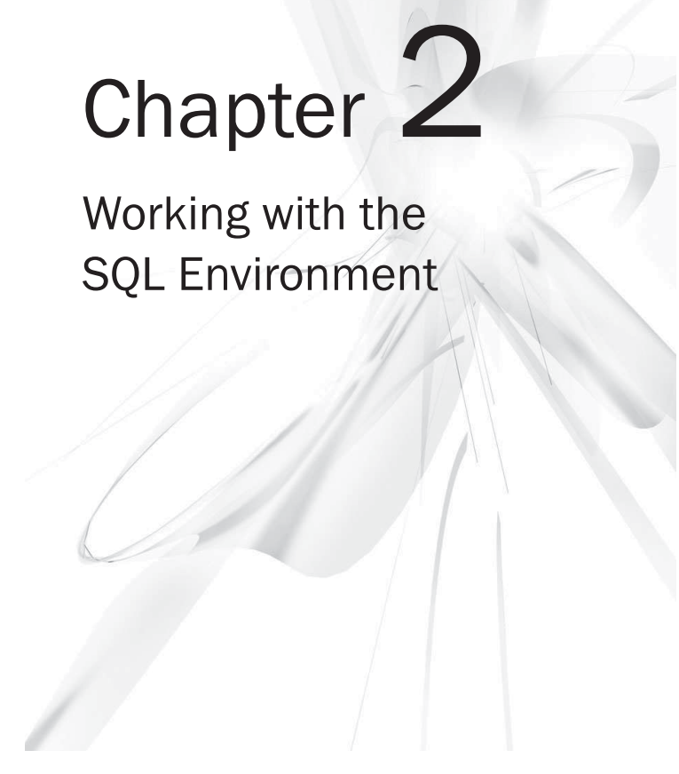

## Working with the SQL Environment

**Key Skills & Concepts**

* Understand the SQL Environment
* Understand SQL Catalogs
* Name Objects in an SQL Environment
* Create a Schema
* Create a Database

**Understand the SQL Environment**

Essentially, the SQL environment consists of multiple components that work together to enable SQL operations, such as
creating and modifying objects, storing and querying data, and modifying or deleting data. These components form a model
that serves as the foundation for a relational database management system (RDBMS). It's worth noting, however, that
RDBMS vendors have some flexibility in implementing these components according to their preferences. Nonetheless, in
this context, I will provide an overview of the distinct components of the SQL environment, as outlined in the SQL:2006
standard.

The SQL:2006 standard defines the SQL environment as comprising six types of components, as illustrated in the scheme.
The SQL client and SQL servers are included in the SQL implementation and are therefore considered subtypes of this
component.

It is important to note that there is only one SQL agent and one SQL implementation, while there can be multiple
components for other types, such as catalogs and sites. According to the SQL:2006 standard, there must be precisely one
SQL agent and SQL implementation, and zero or more SQL client modules, authorization identifiers, and catalogs. The
standard does not specify the number of sites that can be supported, but it implies that multiple sites are possible.

